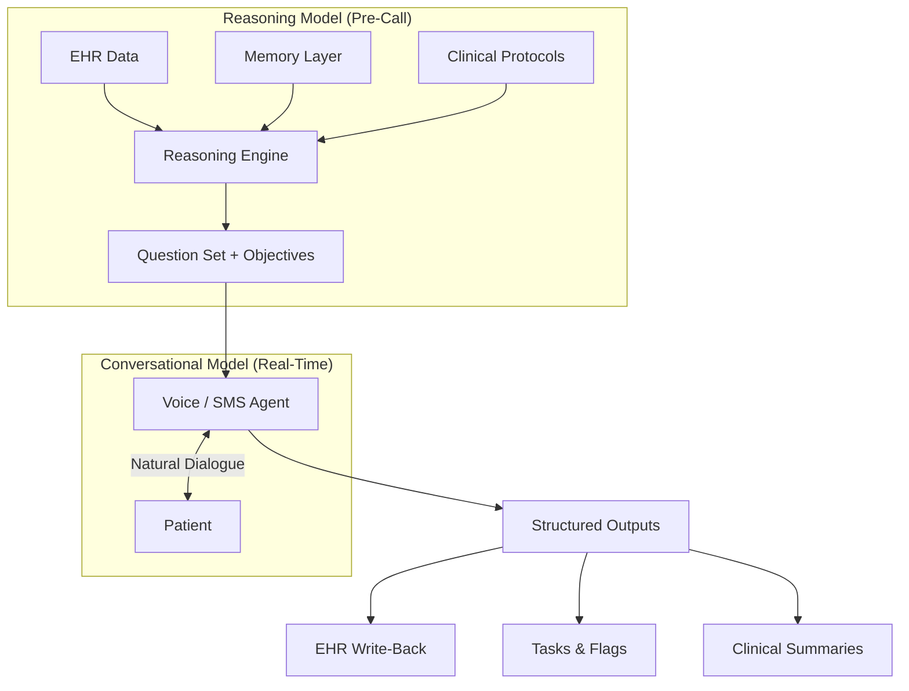

# Technical Architecture

HANA is built on a **dual-model architecture** that separates clinical reasoning from real-time patient conversation. This design solves a fundamental tension in healthcare AI: the more reasoning you do, the more latency you introduce — but clinical conversations demand both depth and speed.

## Two-Model Architecture

### The Reasoning Model (Pre-Call Analysis)

Before each patient interaction, a specialized reasoning model performs preparation by analyzing all existing patient data. Its role is to determine:

- What questions should be asked (and what should not — because the system already knows the answer)
- What clinical protocols apply to this patient's condition and stage
- What interaction patterns this patient prefers (voice vs. text, time of day, communication style)
- What the objective of this specific conversation is

The reasoning model ingests data from five distinct layers:

| Layer | Function |
|-------|----------|
| **Memory Layer** | Past conversations, interaction patterns, patient preferences |
| **EHR & Patient Data** | Chart data, medications, diagnoses, lab results |
| **Clinical Protocols** | Clinic-defined guidelines, standardized assessments, escalation procedures |
| **Engagement & Personalization** | Cultural context, language preferences, optimal contact timing |
| **Safety & Observability** | Risk thresholds, monitoring rules, audit requirements |

### The Conversational Model (Real-Time Interaction)

A low-latency conversational model handles the actual two-way dialogue with patients. It receives the pre-computed question set and objectives from the reasoning model, then delivers them conversationally.

This decoupling provides critical advantages:

- **Low latency** — The conversational agent doesn't need to reason in real-time; it executes a pre-prepared plan
- **Safety boundaries** — The agent has a defined objective and question set, preventing off-topic drift
- **Consistent quality** — Every conversation follows the clinical protocol, adapted to the patient's context

<Note>
  The questions are pre-made based on the objective the agent has *and* the past conversations the patient has had. The reasoning model crunches the information, prepares the question set, then hands the script to the voice agent for conversational delivery.
</Note>

## Multi-Agent System

Within HANA's architecture, specialized agents handle different aspects of the engagement workflow:

<CardGroup cols={3}>
  <Card title="Data Science Agent" icon="magnifying-glass-chart">
    Analyzes existing intake data to identify missing or incomplete data points. Ensures the system never asks for information it already possesses.
  </Card>
  <Card title="Health Coach Agent" icon="user-nurse">
    Conducts empathetic, multi-turn conversations to gather narrative context — the qualitative nuances that standard checkboxes fail to capture.
  </Card>
  <Card title="Domain Expert Agent" icon="brain">
    Reasons over all collected data to synthesize clinically-rich pre-assessment summaries for the care team.
  </Card>
</CardGroup>

## Model Stack

HANA operates on its own infrastructure rather than relying on third-party foundation model APIs:

| Component | Implementation |
|-----------|---------------|
| **Reasoning Engine** | Open-source models (OSS) running on HANA-controlled servers |
| **Voice Agents** | LLaMA 3.1 for conversational delivery |
| **Data Processing** | Proprietary pipeline trained on 1M+ patient interactions |
| **Hosting** | Region-locked cloud infrastructure (EU servers for EU patients, US for US) |

<Warning>
  HANA does not use OpenAI or other third-party APIs for patient data processing. All models run on HANA-controlled servers, ensuring full data sovereignty and GDPR/HIPAA compliance.
</Warning>

## The Data Flywheel

HANA's architecture creates a compounding advantage:

1. **More conversations** → richer training data
2. **Richer data** → smarter reasoning model
3. **Smarter model** → better patient outcomes
4. **Better outcomes** → more clinic adoption
5. **More adoption** → more conversations

The platform has processed over **1 million patient interactions** across multiple countries, languages, and clinical settings — creating a proprietary dataset that cannot be replicated with off-the-shelf LLMs.

## Interaction Scoring

HANA measures quality at the **interaction level**, not the conversation level:

- A single conversation may contain 15 interactions
- Each interaction is scored for **relevance**, **safety**, **clinical accuracy**, and **engagement quality**
- This granular scoring feeds back into model improvement

This approach ensures that quality is measured at the level that matters — whether the right question was asked, the right answer was captured, and the right risk signal was detected.

## On-Premise Deployment

For organizations with strict data residency requirements (large hospital systems, government contracts, sovereign cloud mandates), HANA supports **on-premise installation**:

- Full platform installed on the organization's own servers
- Licensing-based model
- No external data transmission
- Currently being tested with hospital systems in Italy and the Middle East

<Info>
  Because HANA runs its own open-source models on its own servers, on-premise deployment is architecturally straightforward — unlike solutions built on cloud-only foundation model APIs.
</Info>
