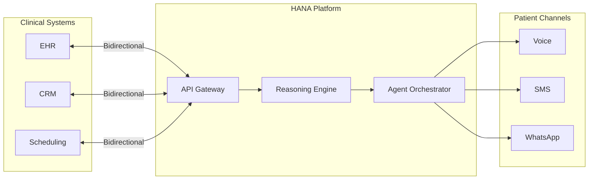

# Integrations

HANA's API-first architecture is designed to embed directly into existing clinical infrastructure. The platform supports bidirectional data exchange with EHR systems, CRM tools, and operational platforms.

## EHR Integrations

### Direct Integrations

| EHR System | Integration Type | Status |
|------------|-----------------|--------|
| **Charma** | Direct API | ✅ Live |
| **PracticeQ** | Direct API | ✅ Live |
| **Athena Health** | Via Redox | ✅ Live |
| **Custom Systems** | Custom API | ✅ 2 live deployments |

### Integration Connectors

| Connector | Function | Status |
|-----------|----------|--------|
| **Redox** | FHIR-based EHR interoperability platform — connect to Athena, Epic, Cerner, and more | ✅ Live |
| **Catagon** | EHR integration hub (Zapier for healthcare) — connect to multiple EHR systems through a single integration | ✅ Live |
| **MCP Servers** | Model Context Protocol servers for cloud-based tool integration (e.g., Salesforce) | 🔧 In Development |

### Supported Standards

- **HL7 FHIR** — for standardized clinical data exchange
- **REST APIs** — for custom integrations with any system that exposes an API
- **Webhooks** — for real-time event notifications and triggers

## Integration Architecture

## Data Flow

### Inbound (to HANA)

Data that flows from clinical systems into HANA:

- Patient roster and demographics
- Clinical chart data (diagnoses, medications, labs)
- Device alerts and sensor data (for wearable integrations)
- Care protocols and clinical guidelines
- Appointment schedules and status

### Outbound (from HANA)

Data that HANA writes back to clinical systems:

- Call outcomes and completion status
- Conversation summaries (structured clinical notes)
- Risk alerts and escalation triggers
- Compliance metrics and engagement scores
- Task lists for clinical follow-up

## Integration Timeline

| EHR Type | Typical Integration Time |
|----------|------------------------|
| Modern cloud EHR (Athena, PracticeQ) | **2–4 weeks** |
| Via Redox or Catagon connector | **3–5 weeks** |
| Custom / legacy EHR | **6–12 weeks** |
| No EHR (standalone dashboard) | **1–2 weeks** |

## Standalone Dashboard

For clinics without an EHR or those that prefer a separate view, HANA provides a white-label agent control dashboard:

- Built and deployed in 1–2 days
- Connected to HANA agents via API
- Provides full visibility into conversations, tasks, and metrics
- Operates alongside the existing EHR (two-tab workflow)

<Note>
  While HANA prefers direct EHR integration for the best clinical experience, the standalone dashboard ensures no clinic is excluded due to technical limitations.
</Note>

## Platform SDK (HANA Connect)

For digital health companies and platform partners, HANA provides a developer SDK:

- White-label HANA's engagement engine within your product
- Full API access to conversation management, patient enrollment, and reporting
- Typical integration time: **6 weeks**
- Proven 40% engagement lift within 90 days for partner platforms

<Info>
  **Integration example:** A mental health app integrated HANA via SDK to add voice-based engagement. The partner kept their UX and clinical workflows — HANA handled the conversations that kept patients engaged between app sessions.
</Info>
