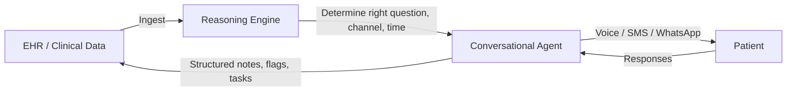

# Platform Overview

HANA is a **healthcare-first agent platform for patient communications**. It combines voice and messaging workflows, deep integration into clinical systems (EHR, CRM, operational tooling), and structured operational outputs (flags, tasks, summaries) so care teams can act on what happened in conversations.

## What HANA Does

<CardGroup cols={2}>
  <Card title="Protocol-Driven Patient Calls" icon="phone">
    Run pre-op, post-op, exam prep, follow-up, and adherence calls following clinic-defined protocols.
  </Card>
  <Card title="SMS-First Scheduling" icon="message">
    Start with SMS, then schedule voice calls at a patient-chosen time for maximum response rates.
  </Card>
  <Card title="Knowledge-Base Sourced" icon="book">
    Use your documents (PDF, Docs, knowledge bases) as the source of truth for what the agent says.
  </Card>
  <Card title="Structured Outputs" icon="list-check">
    Produce tasks, flags, summaries, and transcripts after every call — not just conversation logs.
  </Card>
  <Card title="EHR Write-Back" icon="rotate">
    Feed results back into your stack via API or provide a white-label dashboard if you don't have an EHR.
  </Card>
  <Card title="Multi-Channel" icon="layer-group">
    Support SMS, voice, WhatsApp, Telegram, and iMessage — meeting patients on whatever channel they use.
  </Card>
</CardGroup>

## The Closed-Loop System

HANA creates a continuous feedback loop between clinical systems and patient touchpoints:

<Steps>
  <Step title="Ingest">
    The system reads the patient's chart and clinical context directly from the EHR. It knows what the clinic already knows — so patients are never asked redundant questions.
  </Step>
  <Step title="Reason">
    The adaptive reasoning engine analyzes existing data, past conversations, and clinical protocols to determine the right question, the right channel, and the right time.
  </Step>
  <Step title="Engage">
    A conversational agent interacts with the patient through natural, empathetic dialogue — gathering rich narrative context that static forms miss.
  </Step>
  <Step title="Write-Back">
    The system structures each conversation into clinical notes, tasks, and flags, then writes them back to the EHR. Clinicians get synthesized, actionable intelligence.
  </Step>
</Steps>

## Deployment Model: Stripe for Healthcare

HANA operates like **Stripe** — offering two deployment paths:

<CardGroup cols={2}>
  <Card title="HANA Direct (Stripe Checkout)" icon="plug">
    Plug HANA directly into a clinic's workflow. Start with one use case (e.g., no-show recovery or intake), then expand across the organization. HANA handles everything end-to-end.
  </Card>
  <Card title="HANA Connect (Stripe Connect)" icon="code">
    Platforms and digital health companies build on top of HANA's infrastructure via SDK. White-label the engagement engine — add voice, conversational intake, or monitoring to any existing product.
  </Card>
</CardGroup>

## Operational Outputs

After every patient interaction, care teams receive:

| Output | Description |
|--------|-------------|
| **Task List** | What needs follow-up, with priority and context |
| **Call Summary** | Why a task was created and what was discussed |
| **Flagged Issues** | Risk signals, adherence concerns, escalation triggers |
| **Transcript** | Full conversation record with optional audio playback |
| **Patient History** | Longitudinal view of calls, tasks, and outcomes over time |

These outputs are designed to reduce manual review and make follow-up reliable — turning conversations into clinical action.

## Supported Use Cases

HANA's reasoning engine is versatile and can power any care workflow:

| Use Case | What HANA Does |
|----------|----------------|
| **Intake & Coordination** | Collect family history, presenting concerns, and risk factors through conversation — reducing intake time by up to 85% |
| **Chronic Care Monitoring** | Weekly or bi-weekly check-ins for diabetes, hypertension, CHF, and other chronic conditions |
| **Behavioral Health** | BHI/BHE program support, PHQ-9/GAD-7 screening, therapeutic alliance maintenance |
| **Pre-Op / Post-Op** | Surgical readiness checks, preparation reminders, post-discharge follow-up |
| **Medication Adherence** | Conversational adherence monitoring that uncovers barriers (cost, side effects, confusion) |
| **No-Show Recovery** | Proactive outreach to re-engage patients who miss appointments |
| **Wearable Engagement** | Contextual follow-up on device alerts — turning raw data into clinical insight |
| **Care Program Enrollment** | CCM, BHI, PCM, APCM enrollment and ongoing monitoring for reimbursable programs |

<Info>
  Every clinic has different problems. HANA doesn't ship a prepackaged solution — it maps your workflow and deploys accordingly. We usually start with a single use case, then expand.
</Info>
