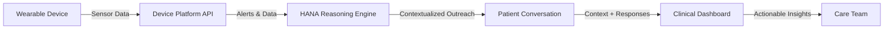

# Wearable Device Integration

## The Problem

Remote monitoring devices generate vast amounts of physiological data — but data without context is noise. When a wearable flags poor sleep, the care team can't tell if it's a medication side effect, a life stressor, or a symptom flare. Every alert looks the same: a number outside a threshold.

The result: alert fatigue for staff, alarm fatigue for patients, and missed opportunities to intervene early.

## How HANA Solves It

HANA acts as an **engagement layer** between wearable devices and clinical teams, adding the crucial context that raw alerts can't provide.

When a wearable flags an anomaly, HANA doesn't just forward the alert. It calls the patient:

> "I noticed your sleep has been off this week. Can you tell me what's been going on?"

The response — stress at work, medication making them drowsy, nothing in particular — gets routed appropriately. Real clinical issues escalate. Noise gets filtered.

## Engagement Workflows

<CardGroup cols={2}>
  <Card title="Scheduled Wellness Checks" icon="calendar-check">
    Proactive calls to establish a health baseline, detecting subtle changes in wellbeing, mood, or physical function that sensor data alone might miss.
  </Card>
  <Card title="Device Compliance Prompts" icon="watch">
    Gentle, conversational reminders to ensure patients are consistently wearing and charging their monitoring devices.
  </Card>
  <Card title="Post-Alert Follow-Up" icon="bell">
    API-triggered calls in response to specific device alerts (elevated heart rate, irregular sleep), gathering context to differentiate true concerns from benign events.
  </Card>
  <Card title="Medication Adherence Monitoring" icon="pills">
    Proactive calls to improve medication compliance while monitoring for potential side effects and gathering patient-reported feedback.
  </Card>
</CardGroup>

## Integration Architecture

## Proven Results

| Metric | Before HANA | After HANA |
|--------|-------------|------------|
| Alert context | Raw numbers without explanation | **Contextualized summaries with patient voice** |
| Staff triage ability | Couldn't differentiate real vs. false alerts | **Exception-based workflow** |
| Baseline adherence | 30% | **>70%** |
| Low-value alert volume | High (alert fatigue) | **60% reduction** |
| Early warning detection | Missed | **Proactive intervention on real issues** |

## 30-Day Pilot Programme

HANA offers a structured 30-day pilot for wearable integration, designed as a low-risk, high-impact initiative to validate the engagement layer approach.

<Card title="30-Day Pilot Details →" icon="arrow-right" href="/pilots/30-day-pilot">
  See the full implementation plan for wearable device integration pilots.
</Card>
